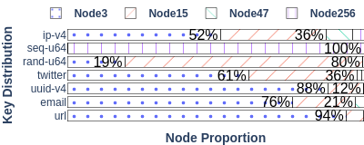
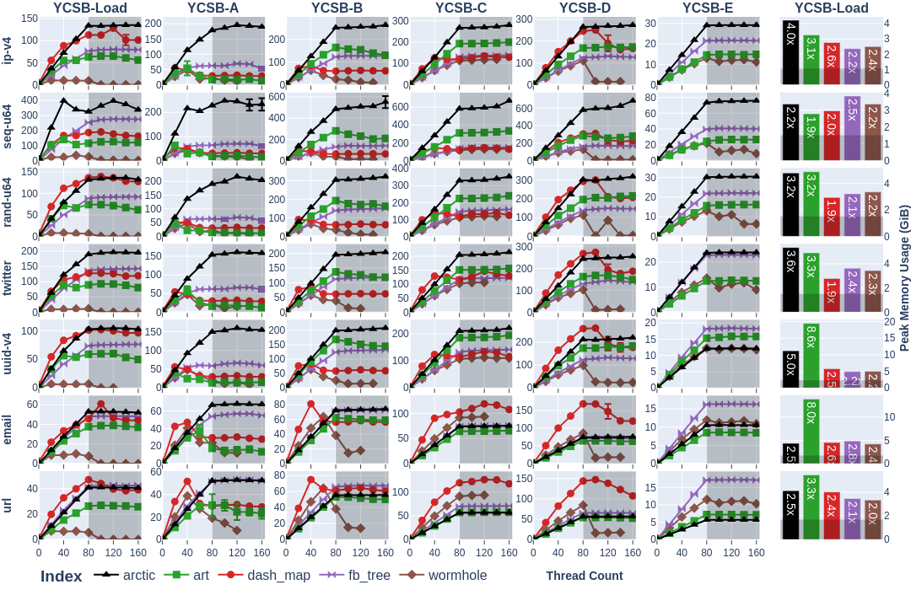
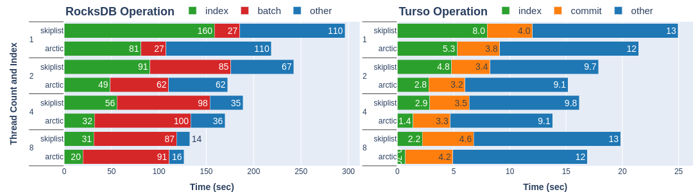
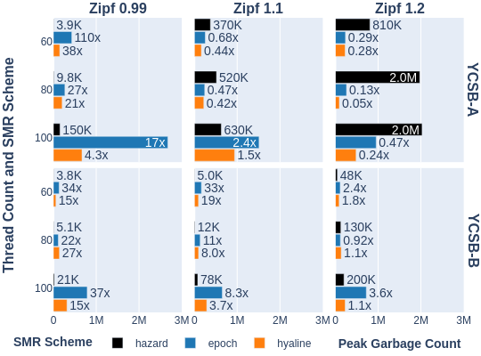
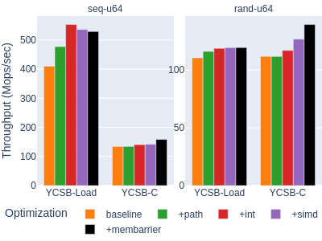

# index-bench

Benchmark harness for concurrent shared memory index data structures.

This is the main artifact for "Arctic: a practical lock-free adaptive radix tree",
published in OSDI 2026. The source code for `arctic` itself can be found in
[this repository](https://github.com/nwtnni/arctic).

## Getting started

The main setup script is `script/setup.sh`, which we typically use to
set up a fresh [Chameleon Cloud](https://www.chameleoncloud.org/)
`compute_icelake_r650` instance running a `CC-Ubuntu22.04` image.
The default benchmark configurations assume at least two NUMA nodes
and 80 physical cores. We've only run experiments on Linux and Intel x86-64.

We use a [Nix](https://nixos.org/) flake and [direnv](https://direnv.net/)
to set up a reproducible build environment. The setup script installs
these, downloads some benchmark datasets (~6.1GiB total), and clones
some submodules and two macrobenchmark repositories.

Once everything is installed, build the benchmark runner with:

```bash
cargo build --release
```

The runner takes a path to a configuration file (stored in `bench/`),
and appends structured JSON output to a `result.ndjson` file.
As a smoke test, we include a basic configuration that should only
take a few seconds to run:

```bash
cargo run --release -- ./bench/basic.toml
```

Scripts for plotting and visualizing `result.ndjson` are stored in `plot/`.
The main script for interactively inspecting the data is `plot/dashboard.py`,
which opens a web interface:

```bash
cd plot
python3 dashboard.py ../result.ndjson
```

## Details

We will now explain how to reproduce each figure in our paper.

### Node type distribution (Figure 8)



```bash
cargo build --release --features stat
cargo run --release --features stat ./bench/load-stat.toml
# Output in result.ndjson
cd plot
python3 node_distribution.py ../result.ndjson
# Output in node-distribution.pdf
```

### YCSB microbenchmarks (Figure 9)



NOTE: these experiments take a long time with the paper configuration.
You can reduce the time in various ways, e.g., lowering the number of
trials in `script/ycsb.sh` or operations in `bench/ycsb-*`, or
skipping thread counts of 1.

Running one full trial (excluding wormhole, which uses spinlocks and
slows down significantly past 80 threads) takes about 5 hours.
Excluding thread counts of 1 (and wormhole) takes about 50 minutes.

```bash
./script/ycsb.sh
# Output in ycsb-load.ndjson, ycsb-a-b-c.ndjson, ycsb-d.ndjson, ycsb-e.ndjson
cd plot
python3 ycsb.py ../ycsb-*.ndjson
# Output in ycsb.pdf
```

### Macrobenchmarks (Figure 10)



The [rocksdb-arctic](https://github.com/nwtnni/rocksdb-arctic/tree/main)
and [turso-arctic](https://github.com/jennyhour/turso-arctic) repositories
should be cloned into the home directory and set up by `script/setup.sh`.

```bash
cd ~/turso-arctic/perf/throughput/turso
./script/bench.sh
# Output in turso.csv

cd ~/rocksdb-arctic
./bench.sh
# Output in ./bench/out/report.tsv

cd ~/index-bench/plot
python3 \
    macro.py \
    ~/turso-arctic/perf/throughput/turso/turso.csv \
    ~/rocksdb-arctic/bench/out/report.tsv
# Prints table of relative throughputs
# Output in macro.pdf
```

### Safe memory reclamation (Figure 11)



```bash
./script/smr.sh
# Output in smr.ndjson

cd plot
python3 smr.py ../smr.ndjson
# Output in smr.pdf
```

### Ablation (Figure 12)



```bash
./script/ablation.sh
# Output in ablation.ndjson
cd plot
python3 ablation.py ../ablation.ndjson
# Output in ablation.pdf
```
